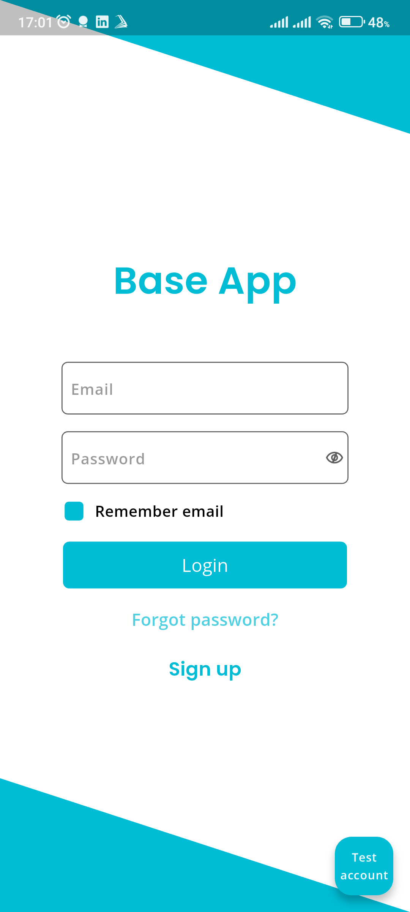

# Flutter clean architecture bloc base project

A Flutter project following Clean Architecture principles, using BLoC for state management and comprehensive testing.

<p align="center">
  
</p>


## 🏗️ Project Structure

The project follows Clean Architecture with the following layers:

```
lib/
  ├── features/                  # Feature-based modules
  │   └── feature_name/
  │       ├── data/              # Data layer
  │       │   ├── datasources/   # Data sources (local/remote)
  │       │   ├── models/        # Data models
  │       │   └── repositories/  # Repository implementations
  │       │
  │       ├── domain/            # Domain layer
  │       │   ├── entities/      # Business objects
  │       │   ├── repositories/  # Repository interfaces
  │       │   └── use_cases/     # Business logic
  │       │
  │       └── presentation/      # Presentation layer
  │           ├── blocs/         # BLoCs and events
  │           ├── screens/       # Feature screens
  │           └── widgets/       # Reusable widgets
  │
  ├── core/                      # Core functionality and utilities
  │   ├── base_bloc/             # Base BLoC
  │   ├── entities/              # Base entities
  │   ├── models/                # Base models
  │   ├── cache/                 # App cache
  │   ├── failures/              # Custom exceptions and failures
  │   ├── utils/                 # Utility functions and extensions
  │   └── ...
  │
  ├── config/                    # App configuration
  │   ├── theme/                 # App theme
  │   ├── di/                    # Dependency injection
  │   └── app_config.dart        # App configuration
  │   └── ...
  │
  ├── app.dart                   # App 
  ├── main.dart                  # Production entry point
  ├── main_dev.dart              # Dev entry point
  ├── main_staging.dart          # Staging entry point
```

## 🚦 BLoC Pattern

The app uses the BLoC (Business Logic Component) pattern for state management:

- **Events**: Represent user actions
- **States**: Represent different UI states
- **Bloc**: Processes events and emits states

### Example BLoC Structure:
```dart
// events/
class IncrementEvent extends BaseEvent {}

// states/
class IncrementState extends BaseState {}

// bloc/
class IncrementBloc extends BaseBloc {
  IncrementBloc() : super(InitialState()) {
    on<IncrementEvent>((event, emit) {
      emit(IncrementState());
    });
  }
}
```

## 🗺️ Routing
Check it out at [app_router.dart](lib/config/app_router.dart)

## 🧪 Testing

### Unit Tests
- Tests for Datasources
- Tests for Repositories
- Tests for UseCases
- Tests for BLoCs

### Widget Tests
- Tests for UI Widges
- Tests for widget interactions

### Integration Tests
- Test for End-to-end features

## 🛠️ Getting Started

1. **Clone the repository**
   ```bash
   git clone https://github.com/dttrung-99931/flutter_clean_arch_bloc_base
   cd flutter_clean_arch_bloc_base
   ```

2. **Install Flutter version FVM**
   ```bash
   fvm install
   ```
   OR change flutter sdk version to the verssion in .fvm/fvm_config.json
   

3. Change appName, bundleId
    Use `rename` to change app name, bundleId
    
    Install rename if not installed
    ```bash
    fvm flutter pub global activate rename
    ```
    
    Change app name, bundleId
    ```bash
    rename setAppName --value "YourAppName"
    rename setBundleId --value "com.yourcompany.yourapp"
    ```

4. **Install dependencies**
   ```bash
   fvm flutter pub get
   ```

5. **Gen code**
   ```bash
   fvm flutter pub run build_runner build --delete-conflicting-outputs
   ```

6. **Run the app**
   Run dev
   ```bash
   fvm flutter run --flavor dev -t lib/main_dev.dart
   ```
   Run staging
   ```bash
   fvm flutter run --flavor staging -t lib/main_staging.dart
   ```
   Run production
   ```bash
   fvm flutter run --flavor production -t lib/main.dart
   ```

## 🧪 Running Tests

- Run all tests:
  ```bash
  fvm flutter test --flavor dev -t lib/main_dev.dart
  ```

- Run tests with coverage:
  ```bash
  fvm flutter test --coverage --flavor dev -t lib/main_dev.dart
  genhtml coverage/lcov.info -o coverage/
  open coverage/index.html
  ```

## ENV

Follow the example in the `.env.example` file in the `assets/env/` folder to create a env file for each flavor (dev (.env.dev), staging (.env.staging), production (.env)).

Example:
.env.dev
```bash
appName=Flutter Base App
apiUrl=https://api.example.com
logResponse=true
logRequest=true
logBloc=true
```


## 📦 Dependencies

- flutter_bloc: ^8.1.3
- equatable: ^2.0.5
- get_it: ^7.6.4
- dio: ^5.3.2
- shared_preferences: ^2.2.2
- flutter_dotenv: ^5.1.0

## 🤝 Contributing

1. Fork the project
2. Create your feature branch (`git checkout -b feature/AmazingFeature`)
3. Commit your changes (`git commit -m 'Add some AmazingFeature'`)
4. Push to the branch (`git push origin feature/AmazingFeature`)
5. Open a Pull Request

## 📄 License

This project is licensed under the MIT License - see the [LICENSE](LICENSE) file for details.
